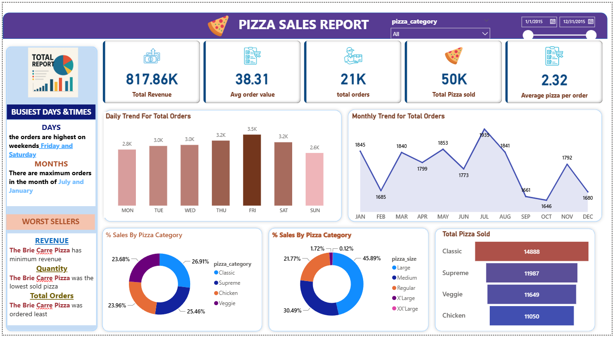
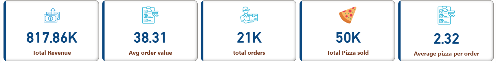
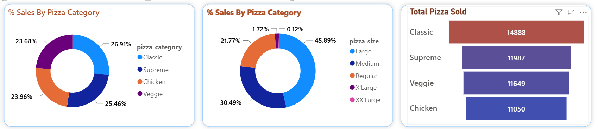

<h1 align="center">🍕 Pizza Sales Dashboard</h1>

<p align="center">
  An end-to-end data analytics project that transforms raw pizza order data into actionable business insights — powered by SQL and Power BI.
</p>

<p align="center">
  
  
  
  
</p>

---

## 📖 About the Project

The **Pizza Sales Dashboard** is a fully interactive business intelligence project built to help a fictional pizza chain understand its sales performance. Using a dataset of **21,000+ real-world-style orders**, the project answers critical business questions through clean SQL analysis and a polished Power BI dashboard.

This project demonstrates the complete analytics pipeline — from raw CSV data → SQL querying → KPI calculation → visual storytelling in Power BI.

---

## 🧱 Architecture

```
pizza-sales-dashboard/
│
├── 📂 dataset/
│   └── pizza_sales.csv          ← Raw source data (~50K rows)
│
├── 📂 sql_queries/
│   ├── kpi.sql                  ← Core KPIs: revenue, orders, avg value
│   └── moreeda.sql              ← EDA: busiest days, category & size trends
│
├── 📂 dashboard/
│   └── pizza.pbix               ← Interactive Power BI dashboard
│
├── 📂 images/
│   ├── dashboard_overview.png   ← Full dashboard screenshot
│   ├── kpi_metric.png           ← Revenue, orders & average value tiles
│   └── category_sales.png       ← Donut charts: category & size breakdown
│
└── README.md
```

**Data Flow:**
```
pizza_sales.csv  →  MySQL (SQL queries)  →  KPIs & EDA Results  →  Power BI Dashboard
```

---

## 📊 Key Metrics

| Metric | Value |
|---|---|
| 💰 Total Revenue | ₹817,860 |
| 🛒 Total Orders | 21,000+ |
| 🍕 Total Pizzas Sold | 50,000+ |
| 🧾 Avg. Order Value | ₹38.31 |
| 📦 Avg. Pizzas Per Order | 2.32 |

---

## 🔍 Business Questions Answered

- 📅 What are the **busiest days and months** for pizza orders?
- 💸 What is the **average order value** and quantity per order?
- 🍕 Which **pizza categories and sizes** are the most and least popular?
- 🏆 Which pizzas are the **top sellers** and which are the **worst performers**?
- 📈 What are the **revenue trends** across different time periods?

---

## 📈 Dashboard Preview

### 🖥️ Full Dashboard Overview


### 📊 KPI Metrics


### 🍕 Sales by Category & Size


---

## 🚀 How to Use

1. **Clone the repository**
   ```bash
   git clone https://github.com/AmanSingh9918/pizza-sales-dashboard.git
   ```

2. **Run SQL Queries**  
   Import `dataset/pizza_sales.csv` into MySQL and execute scripts from the `sql_queries/` folder to generate KPIs and EDA results.

3. **Open the Power BI Dashboard**  
   Open `dashboard/pizza.pbix` in **Power BI Desktop** and refresh the data source pointing to `pizza_sales.csv`.

4. **Explore & Customize**  
   Slice the dashboard by date, category, or size — or add your own visuals using the existing DAX measures.

---

## 🙋‍♂️ Author

<p>
  Made with 💻 & ☕ by <a href="https://github.com/AmanSingh9918"><strong>Aman Singh</strong></a>
</p>

> If you found this helpful, consider giving it a ⭐ — it really helps!
